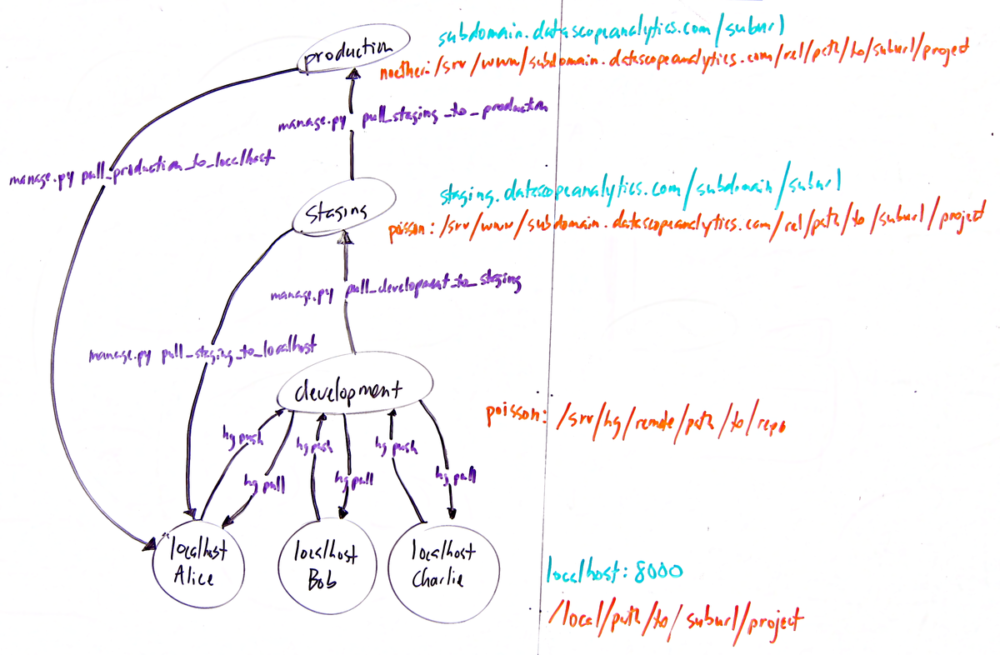

.. _ref_workflow:

Django project workflow
===============================================================================

Our django project workflow is based on allowing several developers
(Alice, Bob and Charlie) develop a django project on their local
computers, which can then be tested on a staging domain before rolling
it out onto a production server for public viewing. 

   Django workflow for a a django project that will ultimately be
   hosted at subdomain.datascopeanalytics.com/suburl. The workflow
   consists of several mercurial repositories (black circles, black
   text) hosted at various places (orange text) that work in tandem
   via shell commands (black arrows, purple text) to take a project
   from local development all the way to production. See details below
   for examples of how you might use these commands.

hg pull
^^^^^^^

The usual ``hg pull`` command allows you to pull changes from
development and share changes with other developers. ``hg up`` will
trigger dbvcs management commands to automatically synchronize your
database with incoming changes to flatfiles.

hg push
^^^^^^^

The usual ``hg push`` command allows you to push changes from your
local development version to share your changes with other
developers. ``hg ci`` will trigger dbvcs management commands to
automatically synchronize your database with outgoing changes to
flatfiles.

manage.py pull_development_to_staging
^^^^^^^^^^^^^^^^^^^^^^^^^^^^^^^^^^^^^
.. automodule:: common.apps.workflow.management.commands.pull_development_to_staging
   :members: Command

manage.py pull_staging_to_production
^^^^^^^^^^^^^^^^^^^^^^^^^^^^^^^^^^^^
.. automodule:: common.apps.workflow.management.commands.pull_staging_to_production
   :members: Command

manage.py pull_staging_to_localhost
^^^^^^^^^^^^^^^^^^^^^^^^^^^^^^^^^^^

.. automodule:: common.apps.workflow.management.commands.pull_staging_to_localhost
   :members: Command

manage.py pull_production_to_localhost
^^^^^^^^^^^^^^^^^^^^^^^^^^^^^^^^^^^^^^

.. automodule:: common.apps.workflow.management.commands.pull_production_to_localhost
   :members: Command

